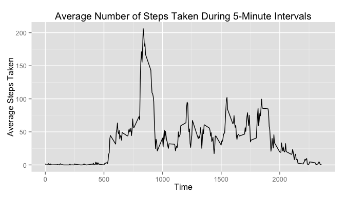
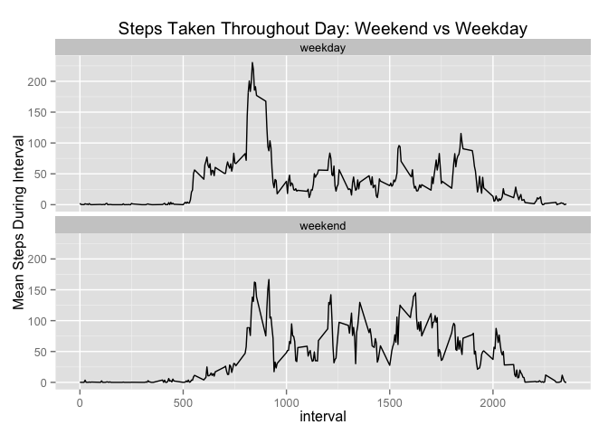

# Reproducible Research: Peer Assessment 1

This document will outline the steps and output for completion of Peer Assignment 1 from the Coursera Reproducible Research Course.  The assignment relies on a data set detailing the number of steps, measured in five-minute intervals, across several days.  

## Loading and preprocessing the data

The first step will be to download the file at the provided URL, and read it into the R workspace:


```r
download.file("https://d396qusza40orc.cloudfront.net/repdata%2Fdata%2Factivity.zip", 
              destfile="./activity.zip",method="curl")
step_data <- read.csv(unz('./activity.zip', 'activity.csv'), header=T)

summary(step_data)
```

```
##      steps                date          interval     
##  Min.   :  0.00   2012-10-01:  288   Min.   :   0.0  
##  1st Qu.:  0.00   2012-10-02:  288   1st Qu.: 588.8  
##  Median :  0.00   2012-10-03:  288   Median :1177.5  
##  Mean   : 37.38   2012-10-04:  288   Mean   :1177.5  
##  3rd Qu.: 12.00   2012-10-05:  288   3rd Qu.:1766.2  
##  Max.   :806.00   2012-10-06:  288   Max.   :2355.0  
##  NA's   :2304     (Other)   :15840
```

We'll also read in a couple packages that will be necessary for the data processing and visualization:


```r
# You can use the message=FALSE option in the code chunk to hide the package load messages when knitting..
library(dplyr)
library(ggplot2)
```

In this block of code, we will transform the *date* field into a Date object in R, and investigate any missing data in the *steps* field. 


```r
## First we'll convert the 'date' field to a Date format. 
step_data <- step_data %>% transform(date = as.Date(date, format="%Y-%m-%d"))

missing_count <- subset(step_data, is.na(steps)) %>% group_by(date) %>% summarize(total = n())
missing_count
```

```
## Source: local data frame [8 x 2]
## 
##         date total
## 1 2012-10-01   288
## 2 2012-10-08   288
## 3 2012-11-01   288
## 4 2012-11-04   288
## 5 2012-11-09   288
## 6 2012-11-10   288
## 7 2012-11-14   288
## 8 2012-11-30   288
```
  
Now that we know there are 8 days with all values missing, and no days with only partially missing values, let's get to work answering the questions laid out in the assignment.  

## What is mean total number of steps taken per day?

We will use the dplyr package to handle grouping and the calculation of summary statistics, and qplot to plot the distribution of total steps taken each day.


```r
step_data_summarized <- step_data %>% group_by(date) %>% summarize(daily_steps = sum(steps))

## And now we'll plot a histogram of the aggregate data (saving as h1 for a multiplot later).
## Note that the 8 days with all missing values will have NA here, and won't be included in the histogram. 
## Given the large values of the distribution, we'll clean the histogram up a bit by setting the binwidth = 1000 

h1 <- qplot(daily_steps, data=step_data_summarized, xlab="Total Steps Taken During the Course of a Day", 
      ylab="# Unique Days", main="Distribution of Steps Taken During a Day", binwidth=1000)

plot(h1)
```

 
  
And now we need to calculate the mean and median number of steps taken each day.


```r
## Now we can use dplyr to group the rows by date, and calculate the total number of steps taken within 
## each day.
step_summary_alldays <- step_data_summarized %>% summarize(mean_daily_steps = mean(daily_steps, na.rm=T), 
    median_daily_steps = median(daily_steps, na.rm=T))

mean_steps <- as.character(round(step_summary_alldays$mean_daily_steps,2))
median_steps <- as.character(step_summary_alldays$median_daily_steps)

print(paste0("Mean Total Daily Steps: ", mean_steps))
print(paste0("Median Total Daily Steps: ", median_steps))
```

```
## [1] "Mean Total Daily Steps: 10766.19"
## [1] "Median Total Daily Steps: 10765"
```
  
So the mean total steps taken across all days (rounded to two decimal places) was 10766.19, 
and the median number of steps was 10765

## What is the average daily activity pattern?

The first thing to do is use dplyr to group the data by 5-minute interval, and then calculate the average number of steps taken during each 5 minute interval across days. We will use qplot to generate a line plot of those data.


```r
# Use dplyr to aggregate steps by interval, and calculate the mean steps within each 5-minute interval. 
fivemin_intervals <- step_data %>% group_by(interval) %>% summarize(mean_interval_steps = mean(steps, na.rm=T))

# And now we'll plot
qplot(interval, mean_interval_steps, data=fivemin_intervals, geom='line', 
      xlab="Time", ylab="Average Steps Taken", 
      main="Average Number of Steps Taken During 5-Minute Intervals")
```

 

  The plot suggests that, on average, there are no measured steps until after 5:00 AM. The measured steps spike around 8-9 AM, and then fluctuate throughout the remainder of the day until roughly 8:00 PM, when they start tapering off. Let's find the time associated with the actual maximum:


```r
fivemin_intervals[which.max(fivemin_intervals$mean_interval_steps),]$interval
```

```
## [1] 835
```

**The peak time of day for walking is 8:35 AM.**  


## Imputing missing values

Considering how simple the data are, we will use the mean value from each five-minute interval as the replacement data. You can test out filling the data with the mean or median value for the interval, but it turns out using the mean value is truer to the original data source.  (The median value dropped the summary statistics significantly)


```r
### Thanks to akrun for suggesting the form of this function: http://stackoverflow.com/questions/26081672/change-variable-values-by-groups-using-dplyr
simple_filler_mean <- function(val) { ifelse(is.na(val), mean(val, na.rm=TRUE), val)} 

# This replaces missing values within each group using the simple_filler() function defined above.  
step_data_meanfilled <- step_data %>% group_by(interval) %>% mutate_each(funs(simple_filler_mean), steps)

message(paste0("There are now ",nrow(subset(step_data_meanfilled, is.na(steps))),
               " rows with missing step counts in the Mean-filled data"))
```

```
## There are now 0 rows with missing step counts in the Mean-filled data
```

Now that we've filled in the missing values, we can plot the distribution of total steps taken each day, and compare the mean and median to the previous values.


```r
step_data_meanfilled_summarized <- step_data_meanfilled %>% group_by(date) %>% 
  summarize(daily_steps = sum(steps))

step_summary_meanfilled_alldays <- step_data_meanfilled_summarized %>% 
    summarize(mean_daily_steps = mean(daily_steps, na.rm=T), 
      median_daily_steps = median(daily_steps, na.rm=T))

filled_mean_steps <- as.character(round(step_summary_meanfilled_alldays$mean_daily_steps,2))
filled_median_steps <- as.character(round(step_summary_meanfilled_alldays$median_daily_steps,2))

print(paste0("Mean Total Daily Steps After Imputing Missing Data: ", filled_mean_steps))
print(paste0("Median Total Daily Steps After Imputing Missing Data: ", filled_median_steps))
```

```
## [1] "Mean Total Daily Steps After Imputing Missing Data: 10766.19"
## [1] "Median Total Daily Steps After Imputing Missing Data: 10766.19"
```

  The mean total step-count was 10766.19, and after filling in missing data, it is 10766.19.

  The median value was originally 10765, and after filling in missing data, it is still 10766.19.

  
  Let's plot the data and see how they look.  We'll also plot the original histogram below it for comparison's sake. 


```r
h2 <- qplot(daily_steps, data=step_data_meanfilled_summarized, 
        xlab="Total Steps Taken During the Course of a Day", 
        ylab="# Unique Days", main="Distribution of Steps Taken During a Day - Missing Values Imputed", 
        binwidth=1000) 

multiplot(h2 + scale_x_continuous(limits = c(0, 24000)) + scale_y_continuous(limits = c(0,20)), 
          h1 + scale_x_continuous(limits = c(0,24000)) + scale_y_continuous(limits=c(0,15)), cols=1)
```

 

  The only change in the plot is an increase in the number of days at the mean value of total steps, 10766.  This increases the bin for data between 10,000-11,000.  


## Are there differences in activity patterns between weekdays and weekends?

In the final part of the analysis, we are asked to compare the distribution of the total number of steps between weekdays and the weekend. 

The first thing we'll need to do is create a new column in the data designating the day of the week, and then convert that to either "weekday" or "weekend" using an ifelse statement to test whether the day is Saturday or Sunday. 
  

```r
# This function outputs either "weekend" or "weekday" depending on whether the 
# day of the week is in c("Saturday","Sunday") or not. 
weekend_parser <- function(day) { ifelse(day %in% c("Saturday","Sunday"),"weekend","weekday")}

# And now we add the day-of-week column and convert it to our desired output. 
step_data_meanfilled <- step_data_meanfilled %>% mutate(day_of_week = weekdays(date))
step_data_meanfilled <- step_data_meanfilled %>% mutate_each(funs(weekend_parser), day_of_week)
```

The final step will then be to aggregate data by whether they corresponds to "weekday" or "weekend", and then plot a histogram.


```r
fivemin_intervals_weeksplit <- step_data_meanfilled %>% group_by(day_of_week, interval) %>% 
  summarize(mean_interval_steps = mean(steps, na.rm=T))

qplot(interval, mean_interval_steps, data=fivemin_intervals_weeksplit, geom='line', 
    ylab="Mean Steps During Interval", main="Steps Taken Throughout Day: Weekend vs Weekday") + 
    facet_wrap(~day_of_week, ncol=1) 
```

 

It appears from the two plots that the peak at 8:35 AM on weekdays does not exist on the weekend.  Perhaps it corresponds to a larger number of people walking to work in a city, which would explain the relative drop during the 9-5 workday.  On the weekends, there is a much more consistent spread of steps throughout the day, which may be because more people are outside and fewer are at work between 9-5. 


That's all the for the assignment, thanks for reading and reviewing!

